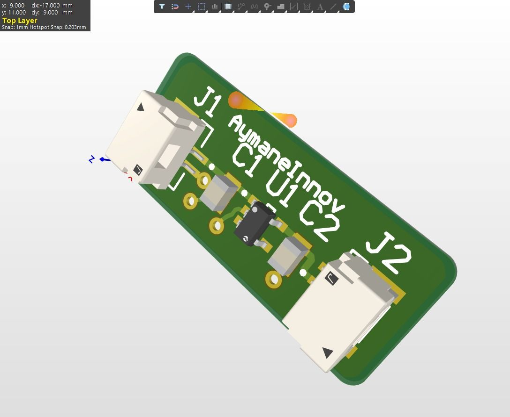
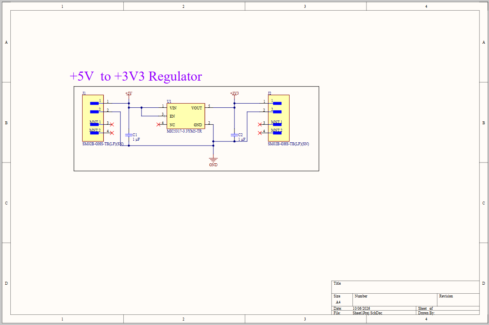

# 5V to 3.3V DC Voltage Regulator PCB

A compact 5V-to-3.3V DC voltage regulator PCB designed in **Altium Designer** as an academic electronics and PCB-design project.

The board is intended to convert a regulated **+5 V DC input** into a stable **+3.3 V DC rail** for low-voltage embedded electronics such as microcontrollers, sensors, communication modules, and development platforms.

---

## Project Preview

The rendered PCB is shown below so the physical design can be understood before opening the schematic and source files.



**Design view:** compact two-connector regulator board with +5 V input, +3.3 V output, SMD regulation components, decoupling capacitors, and board-level power/ground routing.

---

## Project Identity

| Item | Information |
|---|---|
| Project | 5V to 3.3V DC Voltage Regulator |
| Design Tool | Altium Designer |
| Project Type | PCB / Power Electronics |
| Input | +5 V DC |
| Output | +3.3 V DC |
| Regulator | MIC5317-3.3YM5-TR |
| Input Capacitor | C1 = 1 µF |
| Output Capacitor | C2 = 1 µF |
| Input Connector | J1, 2-pin |
| Output Connector | J2, 2-pin |
| Application | Low-voltage embedded electronics |
| Designer | Aymane EL HAOUDAR |
| Academic Profile | 4th-year Electromechanical Engineering, Maintenance & Industrial Control |
| Date on schematic | 10/06/2026 |

---

## 1. Engineering Objective

The objective of this project is to design a small, practical power-conditioning PCB capable of accepting a 5 V DC supply and providing a regulated 3.3 V output.

The project demonstrates the complete transition from a simple electrical requirement to a PCB implementation:

1. Define the input and output voltage requirements.
2. Select an appropriate low-dropout regulator.
3. Design the electrical schematic.
4. Add input and output decoupling.
5. Assign footprints and connectors.
6. Create the PCB layout.
7. Inspect the board in 3D.
8. Prepare the design files for documentation and future fabrication.

---

## 2. Electrical Architecture

```text
             +5 V DC INPUT
                   |
                   |
                 C1 1 µF
                   |
                   v
          +-------------------+
          |  MIC5317-3.3YM5   |
          |                   |
          | VIN          VOUT |------ +3.3 V DC OUTPUT
          |                   |             |
          | EN           GND  |           C2 1 µF
          +-------------------+             |
                   |                         |
                  GND-----------------------+
```

The regulator receives +5 V at VIN and produces a regulated +3.3 V rail at VOUT. C1 and C2 provide local supply decoupling around the regulator.

The EN pin is tied to the input supply in the schematic, so the regulator is enabled when the board receives its input voltage. The NC pin is left unconnected as indicated by the no-connect marker.

---

## 3. Schematic

The complete schematic is included as a project preview below.



The native Altium schematic is preserved in the original project archive located in:

`source/Altium/5V-to-3V3-DC-Voltage-Regulator-Altium.rar`

---

## 4. Main Components

| Ref. | Component | Value / Part Number | Function |
|---|---|---|---|
| U1 | LDO regulator | MIC5317-3.3YM5-TR | 5 V to 3.3 V regulation |
| C1 | Capacitor | 1 µF | Input-side decoupling |
| C2 | Capacitor | 1 µF | Output-side decoupling |
| J1 | 2-pin connector | SM02B-GHS-TB(LF)(SN) | +5 V input interface |
| J2 | 2-pin connector | SM02B-GHS-TB(LF)(SN) | +3.3 V output interface |

### BOM note

The table above is a documentation-level BOM extracted from the visible schematic. Package dimensions, exact capacitor dielectric/package information, PCB footprint assignments, and fabrication-specific attributes should be verified directly in the native Altium project before manufacturing.

A more detailed BOM working sheet is available in [`docs/BOM.md`](docs/BOM.md).

---

## 5. PCB Design

The PCB layout focuses on a compact implementation of the regulator circuit while maintaining clear input/output identification and practical component placement.

The 3D view provides a visual check of:

- Component placement
- Connector orientation
- Board outline
- Silkscreen references
- General routing and copper placement
- Physical manufacturability at a visual inspection level


---

## 6. Design Documentation

| Document | Purpose |
|---|---|
| [`docs/BOM.md`](docs/BOM.md) | Bill of materials and component summary |
| [`docs/DESIGN_NOTES.md`](docs/DESIGN_NOTES.md) | Engineering decisions, verification points, and limitations |
| [`images/3D-render.png`](images/3D-render.png) | PCB 3D preview |
| [`images/Schematic.png`](images/Schematic.png) | Schematic preview |
| `source/Altium/*.rar` | Original Altium project archive |

---

## 7. Expected Electrical Behavior

The nominal conversion is:

**5.0 V DC -> 3.3 V DC**

The voltage difference handled by the regulator is approximately:

**5.0 V - 3.3 V = 1.7 V**

For a linear regulator, the approximate power dissipated in the regulator is:

**P_D ≈ (V_IN - V_OUT) × I_OUT**

Therefore, thermal performance depends strongly on the actual output current. The board should be evaluated against the MIC5317 device limits and the selected PCB copper/thermal configuration before being used at high load.

This repository does not claim a specific maximum output current or thermal performance unless it has been experimentally verified.

---

## 8. Engineering Verification Checklist

Before fabrication or integration into a larger embedded system, verify:

- [ ] Input voltage is within the regulator's specified operating range.
- [ ] Output voltage is measured at the intended load current.
- [ ] C1 and C2 values and package types match the regulator manufacturer's recommendations.
- [ ] PCB footprints correspond to the intended physical components.
- [ ] Connector pin numbering is checked against the selected connector datasheet.
- [ ] Input and output polarity are clearly identified.
- [ ] PCB clearances and manufacturing rules are compatible with the chosen PCB manufacturer.
- [ ] Regulator temperature is checked under the intended operating load.
- [ ] Output ripple and transient behavior are evaluated when required by the application.

---

## 9. Academic and Professional Relevance

This project is part of the development of practical skills in:

- PCB design and electronic hardware development
- Power management and voltage regulation
- Schematic capture
- Component and footprint selection
- SMD PCB layout
- Electrical engineering documentation
- Embedded-system power interfaces
- Hardware prototyping and engineering verification

For an electromechanical engineering profile, the project complements mechanical CAD, automation, control, embedded systems, and robotics work by adding a dedicated electronics and PCB-design component.

---

## 10. Repository Structure

```text
5V-to-3V3-DC-Voltage-Regulator-Altium/
|
|-- README.md
|-- LICENSE
|-- .gitignore
|
|-- images/
|   |-- 3D-render.png
|   `-- Schematic.png
|
|-- docs/
|   |-- BOM.md
|   `-- DESIGN_NOTES.md
|
`-- source/
    `-- Altium/
        `-- 5V-to-3V3-DC-Voltage-Regulator-Altium.rar
```

---

## 11. Source Files

The original Altium project was supplied as a RAR archive and is preserved without modification in the repository.

After extracting the archive locally, the native project contains:

```text
5V to 3.3V DC voltage regulator/
|
|-- LDO-PCB/
|   `-- LDO-PCB.PcbDoc
|
`-- Sheet1Proj/
    `-- Sheet1Proj.SchDoc
```

Open the `.PcbDoc` and `.SchDoc` files with a compatible Altium Designer installation.

---

## 12. Suggested GitHub Topics

```text
altium
altium-designer
pcb
pcb-design
power-electronics
voltage-regulator
ldo
3v3
5v
embedded-systems
electronics
electromechanical-engineering
industrial-control
hardware-design
```

---

## Author

**Aymane EL HAOUDAR**  
4th-year Electromechanical Engineering student  
Maintenance & Industrial Control  
ENSAM Meknès, Morocco

GitHub: [KiaminoTaco](https://github.com/KiaminoTaco)

---

## Project Status

**Design stage:** PCB design completed and 3D visualized.  
**Primary tool:** Altium Designer.  
**Fabrication/testing status:** Not specified in the supplied project material.

This distinction is intentional: the repository documents the design itself without claiming laboratory measurements that were not provided.
